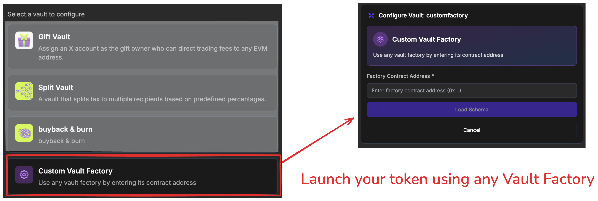
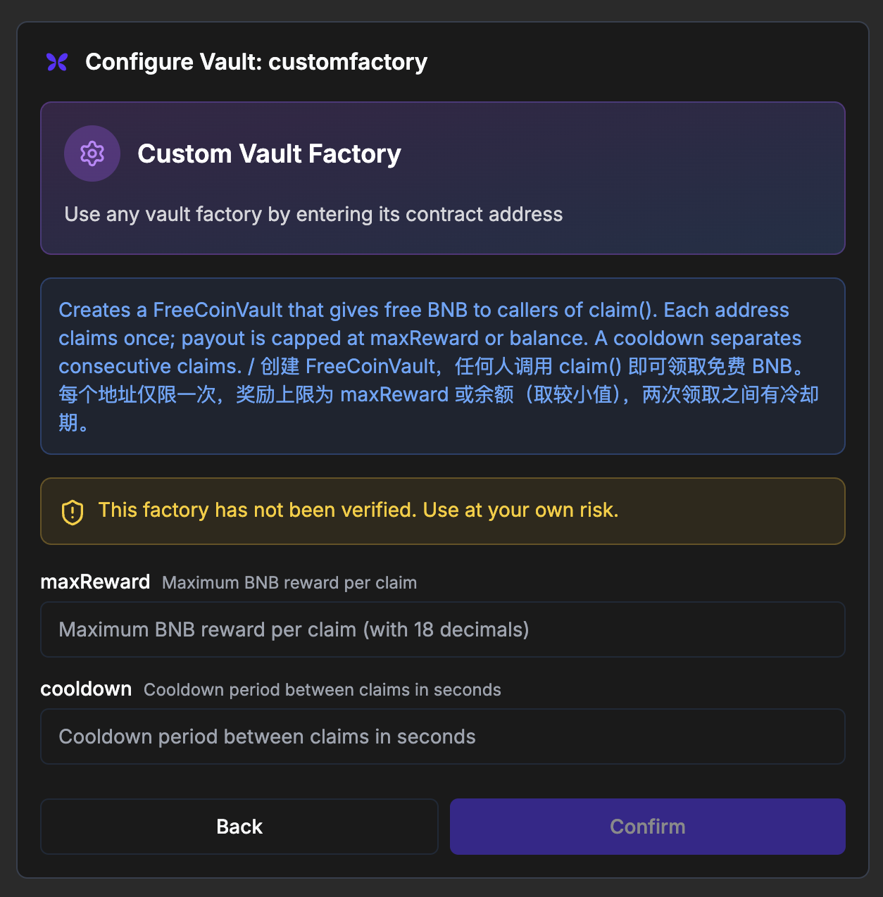
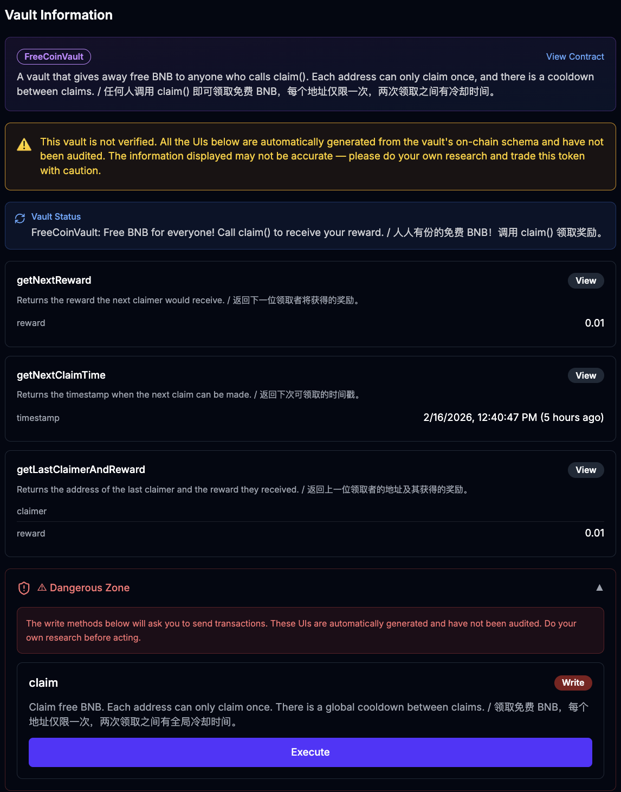

# Flap Tax Vault V2 Example

> Note that it is now permissonless to launch a token using a vault on Flap.sh. You don't need to reach us to regsiter your vault factory or get whitelisted. Just implement the vault factory and vault contracts using the V2 interfaces, deploy them, and then go to Flap.sh to create your token using your own vault factory.  

  

This repo will include example implementations of Flap Tax Vaults using the new V2 interfaces. We will udpate more examples in the future, but for now, we have implemented a simple "FreeCoin" vault that gives free BNB to users who call the `claim()` function, with a cooldown period and a maximum reward limit.  


## The Flap Tax Vault V2 Interfaces 

Flap Tax Vault V2 are fully compatible with the V1 version. The main difference is that the V2 version uses the new VaultFactoryBaseV2 and VaultBaseV2 interfaces, which include additional functions for UI schema and metadata. With these UI schema functions, the vault can provide more information about its parameters and how to interact with it, which can be used for automatically generating user interfaces on Flap.sh.  

- [VaultFactoryBaseV2](src/interface/VaultFactoryBaseV2.sol): This is the base interface for vault factories. It includes functions for creating vaults, as well as new functions for providing metadata and UI schema for the vaults it creates.   
- [VaultBaseV2](src/interface/VaultBaseV2.sol): This is the base interface for vaults. It includes functions for interacting with the vault, as well as new functions for providing metadata and UI schema for the vault itself.   

All the above interfaces include very detailed NatSpec comments that describe the purpose and usage of each function, as well as the expected behavior of the vaults. We encourage you to read through the interfaces to understand how to implement your own vaults using the V2 version. 


## The FreeCoin Vault Example  

For example, for the [FreeCoin](src/Vaults/FreeCoin.sol) vault, the factory has `vaultDataSchema()` function that describes the parameters of the vault:  


```solidity 
/// @inheritdoc VaultFactoryBaseV2
function vaultDataSchema() public pure override returns (VaultDataSchema memory schema) {
    schema.description = unicode"Creates a FreeCoinVault that gives free BNB to callers of claim(). "
        unicode"Each address claims once; payout is capped at maxReward or balance. "
        unicode"A cooldown separates consecutive claims. / " unicode"创建 FreeCoinVault，任何人调用 claim() 即可领取免费 BNB。"
        unicode"每个地址仅限一次，奖励上限为 maxReward 或余额（取较小值），两次领取之间有冷却期。";
    schema.fields = new FieldDescriptor[](2);
    schema.fields[0] = FieldDescriptor("maxReward", "uint256", "Maximum BNB reward per claim", 18);
    schema.fields[1] = FieldDescriptor("cooldown", "uint256", "Cooldown period between claims in seconds", 0);
    schema.isArray = false;
}
```

Based on the above spec, we will show the following UI for the vault on Flap.sh:  
 
  


And the FreeCoin Vault itself has a `vaultUISchema()` function that describes the parameters and functions of the vault:  

```solidity 

    /// @inheritdoc VaultBaseV2
    function vaultUISchema() public pure override returns (VaultUISchema memory schema) {
        schema.vaultType = "FreeCoinVault";
        schema.description = unicode"A vault that gives away free BNB to anyone who calls claim(). "
            unicode"Each address can only claim once, and there is a cooldown between claims. / "
            unicode"任何人调用 claim() 即可领取免费 BNB，每个地址仅限一次，两次领取之间有冷却时间。";

        schema.methods = new VaultMethodSchema[](4);

        // ── View: getNextReward() ────────────────────────────────────────
        schema.methods[0].name = "getNextReward";
        schema.methods[0].description = unicode"Returns the reward the next claimer would receive. / 返回下一位领取者将获得的奖励。";
        schema.methods[0].inputs = new FieldDescriptor[](0);
        schema.methods[0].outputs = new FieldDescriptor[](1);
        schema.methods[0].outputs[0] = FieldDescriptor("reward", "uint256", "Next reward amount in BNB", 18);
        schema.methods[0].approvals = new ApproveAction[](0);

        // ── View: getNextClaimTime() ─────────────────────────────────────
        schema.methods[1].name = "getNextClaimTime";
        schema.methods[1].description = unicode"Returns the timestamp when the next claim can be made. / 返回下次可领取的时间戳。";
        schema.methods[1].inputs = new FieldDescriptor[](0);
        schema.methods[1].outputs = new FieldDescriptor[](1);
        schema.methods[1].outputs[0] = FieldDescriptor("timestamp", "time", "Next claim timestamp (unix)", 0);
        schema.methods[1].approvals = new ApproveAction[](0);

        // ── View: getLastClaimerAndReward() ──────────────────────────────
        schema.methods[2].name = "getLastClaimerAndReward";
        schema.methods[2].description =
            unicode"Returns the address of the last claimer and the reward they received. / 返回上一位领取者的地址及其获得的奖励。";
        schema.methods[2].inputs = new FieldDescriptor[](0);
        schema.methods[2].outputs = new FieldDescriptor[](2);
        schema.methods[2].outputs[0] = FieldDescriptor("claimer", "address", "Last claimer address", 0);
        schema.methods[2].outputs[1] = FieldDescriptor("reward", "uint256", "Reward received by last claimer", 18);
        schema.methods[2].approvals = new ApproveAction[](0);

        // ── Write: claim() ───────────────────────────────────────────────
        schema.methods[3].name = "claim";
        schema.methods[3].description = unicode"Claim free BNB. Each address can only claim once. "
            unicode"There is a global cooldown between claims. / " unicode"领取免费 BNB，每个地址仅限一次，两次领取之间有全局冷却时间。";
        schema.methods[3].inputs = new FieldDescriptor[](0);
        schema.methods[3].outputs = new FieldDescriptor[](0);
        schema.methods[3].approvals = new ApproveAction[](0);
        schema.methods[3].isWriteMethod = true;
    }

```

Based on the above spec, we will show the following UI for interacting with the vault on Flap.sh: 

